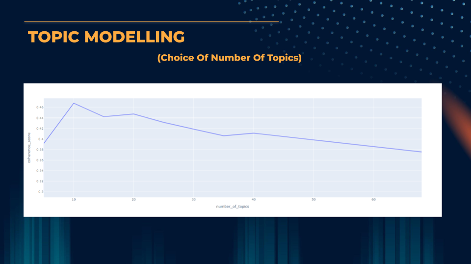
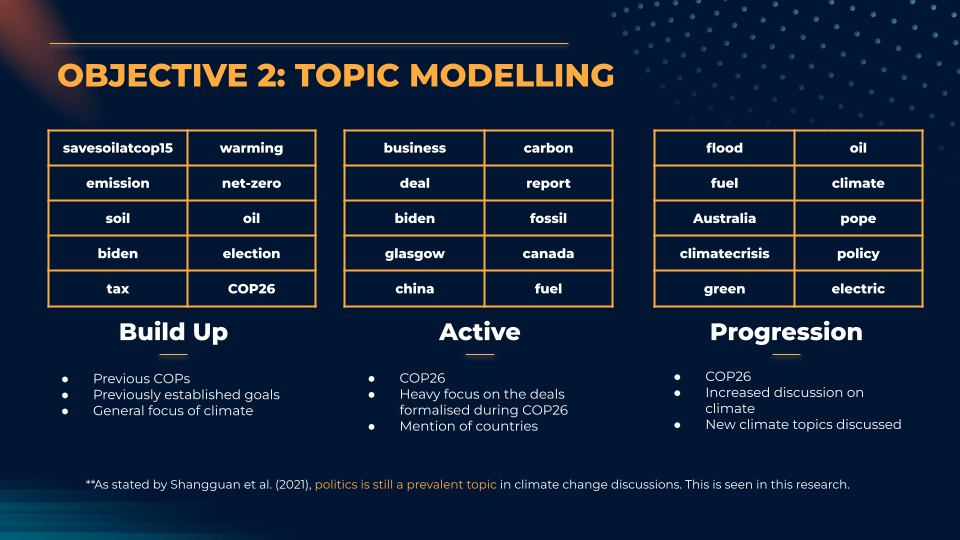
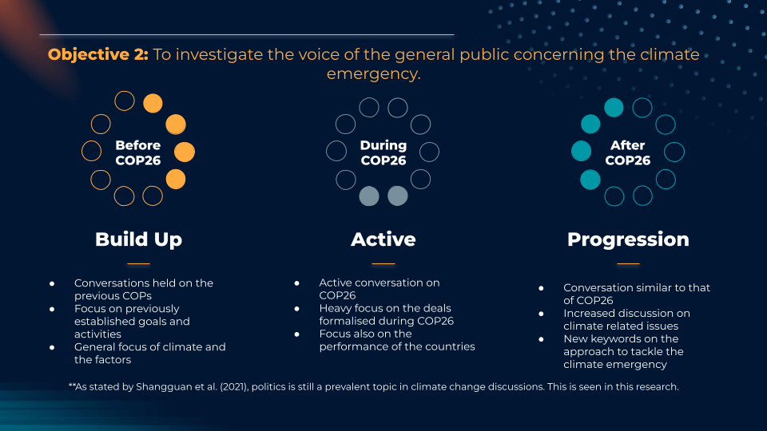

# COP26 Climate-Change-Topic-Modelling

This project focuses on carrying out the Topic Modelling analysis on the trend across three Scenarios pertaining to the commencement of United Nation's Climate Change Confererence of Parties (COP26) hosted at Glasgow, Scotland. The Scenarios are as follows:

1. 6 Months before COP26
2. During COP26
3. 6 months after COP26

The data is scraped from Twitter and undergoes a meticulous process of exploration, cleaning and analysis. The Latent Dirichlet Allocation (LDA) model is applied to identify the issues analysed in this research. For this analysis, a sample number of cases are determined, and the best model is selected based on the coherence score. Models have been run for 5, 10, 20, 40 and 60 topics. The graph below indicates the coherence scores based on the number of topics chosen. 

The best performing model is with the use of 10 topics. Hence, the model with 10 topics is chosen. The model has a perplexity score of -0.843 and a coherence score of 0.468.

The topics identified for each scenarios are as follows:

The interpretation for each scenarios are as follows:

